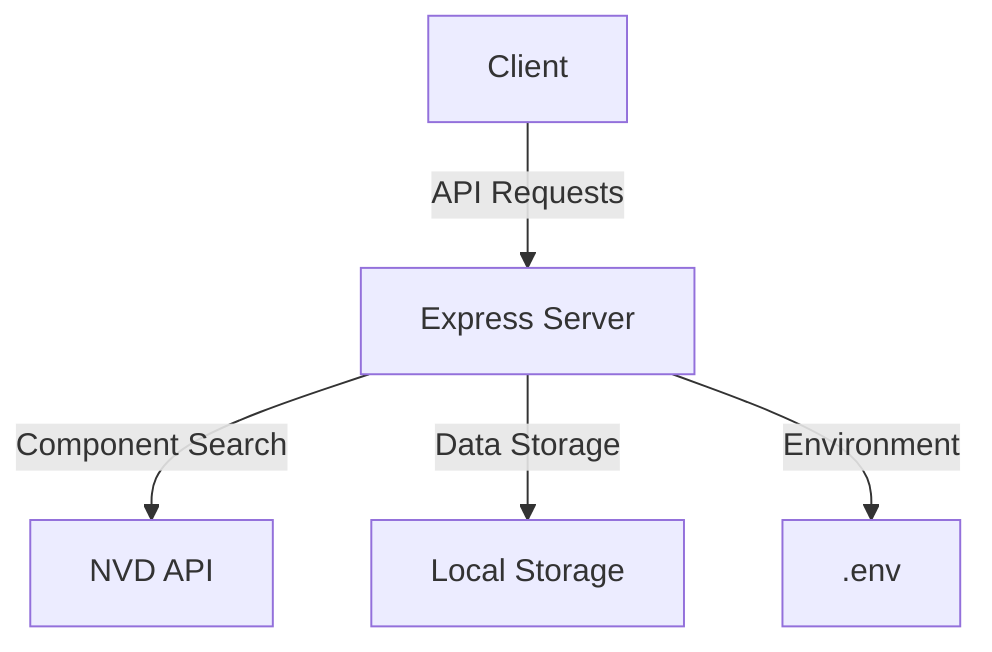

<div align="center">


# SBOM Generator

[](https://opensource.org/licenses/MIT)
[](https://nodejs.org)
[](https://www.typescriptlang.org/)
[](https://reactjs.org/)

A modern, feature-rich Software Bill of Materials (SBOM) generator with real-time NVD vulnerability tracking.

[Features](#features) •
[Quick Start](#quick-start) •
[Documentation](#documentation) •
[Contributing](#contributing)


</div>

---

## 📋 Overview

SBOM Generator is a comprehensive tool designed to create and manage Software Bills of Materials with integrated vulnerability tracking. It offers:

- **Real-time NVD Integration**: Direct access to the National Vulnerability Database
- **Component Management**: Track both public and proprietary components
- **Dynamic Updates**: Real-time vulnerability notifications
- **Modern UI**: Sleek, responsive interface built with React and Tailwind

## ✨ Features

### Core Capabilities
- 🔍 Advanced component search and identification
- 📊 Comprehensive SBOM generation
- 🔐 Vulnerability tracking and alerts
- 🔄 Real-time updates and monitoring

### Technical Features
- ⚡ Dynamic API key management
- 🌐 RESTful API architecture
- 📱 Responsive design
- 🔒 Secure data handling

## 🚀 Quick Start

### One-Step Installation

```bash
git clone https://github.com/rupesh43210/sbom-generator.git
cd sbom-generator
chmod +x install.sh
./install.sh
```

The installation script automatically:
- 📦 Installs dependencies
- ⚙️ Configures environment
- 🔨 Builds application
- 🌐 Starts server

Access your application at `http://localhost:5000` (or alternate port if 5000 is in use)

### NVD Integration Setup

1. Obtain API key from [NVD](https://nvd.nist.gov/developers/request-an-api-key)
2. Add to environment:
   ```bash
   NVD_API_KEY=your-key-here
   ```
3. Key loads automatically - no restart needed

## 🛠️ Technology Stack

### Frontend
- **Framework**: React 18 with TypeScript
- **Build Tool**: Vite
- **Styling**: Tailwind CSS + Radix UI
- **State Management**: React Query
- **Routing**: Wouter

### Backend
- **Runtime**: Node.js
- **Framework**: Express
- **Language**: TypeScript
- **API Integration**: NVD REST API

## 📚 Documentation

### Architecture



### API Endpoints

| Endpoint | Method | Description |
|----------|--------|-------------|
| /api/nvd/search | GET | Search NVD database |
| /api/settings/nvd-key | POST | Update API key |
| /api/sbom/generate | POST | Generate SBOM |
| /api/sbom/validate | POST | Validate SBOM |

### Project Structure

```
sbom-generator/
├── client/                 # Frontend application
│   ├── src/
│   │   ├── components/    # Reusable components
│   │   ├── pages/        # Page components
│   │   └── app.tsx       # Main application
├── server/                # Backend server
│   ├── index.ts          # Server entry
│   └── routes.ts         # API routes
└── shared/               # Shared types/utilities
```

## 🔒 Security

- ✅ Environment variable protection
- ✅ API key encryption
- ✅ Input sanitization
- ✅ Rate limiting
- ✅ Error handling

## 🎯 Roadmap

- [ ] Export formats (CycloneDX, SPDX)
- [ ] Dependency graph visualization
- [ ] Team collaboration features
- [ ] CI/CD integration
- [ ] Custom vulnerability rules

## 🤝 Contributing

We welcome contributions! See our [Contributing Guide](CONTRIBUTING.md) for details.

1. Fork the repository
2. Create feature branch
   ```bash
   git checkout -b feature/amazing-feature
   ```
3. Commit changes
   ```bash
   git commit -m 'Add amazing feature'
   ```
4. Push to branch
   ```bash
   git push origin feature/amazing-feature
   ```
5. Open Pull Request

## 📈 Performance

- **Bundle Size**: < 500KB (gzipped)
- **API Response**: < 100ms
- **Build Time**: < 2s
- **Lighthouse Score**: > 90

## 🔧 Manual Setup

For those who prefer manual control:

```bash
# Install dependencies
npm install

# Configure environment
cp .env.example .env

# Build and start
npm run build
npm run start
```

## 📝 License

This project is licensed under the MIT License - see the [LICENSE](LICENSE) file for details.

## 👤 Author

**Rupesh**
- GitHub: [@rupesh43210](https://github.com/rupesh43210)
- LinkedIn: [Rupesh](https://linkedin.com/in/rupesh)

## 🙏 Acknowledgments

- [NVD API](https://nvd.nist.gov/developers/start-here) for vulnerability data
- [Radix UI](https://www.radix-ui.com/) for accessible components
- [Tailwind CSS](https://tailwindcss.com/) for styling

## 💬 Support

- 📧 Email: support@sbomgenerator.dev
- 💻 Issues: [GitHub Issues](https://github.com/rupesh43210/sbom-generator/issues)
- 📚 Wiki: [Project Wiki](https://github.com/rupesh43210/sbom-generator/wiki)

---

<div align="center">

[Rupesh](https://github.com/rupesh43210) Built with ❤️ and 💪 


</div>
